# Short Story Crew 🎬

An advanced AI-powered storytelling system that generates complete 15-second short story scripts from simple user ideas using CrewAI and multiple specialized AI agents. Now with **genre-based story generation**, **advanced logging**, **OpenRouter support**, **different AI models** for each crew member, and **enterprise-grade code quality**.

## 🎭 Meet the Enhanced Crew

- **🎬 Creative Director** - Sets overall creative vision and genre-specific direction
- **✍️ Genre-Aware Story Writer** - Creates compelling narratives adapted to specific genres
- **📝 Professional Proofreader** - Reviews and refines story for clarity, grammar, timing, and genre consistency
- **🎨 Genre-Specific Art Designer** - Develops detailed visual descriptions optimized for genre-appropriate image generation
- **📋 Script Coordinator** - Compiles everything into a genre-consistent production-ready script format

## ✨ Enhanced Features

### 🎭 Genre-Based Story Generation
- **24+ Supported Genres**: anime, romance, horror, sci-fi, comedy, kids, thriller, fantasy, and more
- **Genre-Specific AI Agents**: Each crew member adapts their style to the selected genre
- **Authentic Genre Elements**: Characters, dialogue, visual style, and pacing tailored to genre conventions

### 🤖 Multi-Model AI System  
- **Different AI Models**: Each crew member uses optimized models (GPT-4, GPT-4o, GPT-4o-mini)
- **OpenRouter Support**: Use multiple AI providers and models seamlessly
- **Configurable Models**: Customize which AI model each crew member uses

### 📊 Advanced Logging System
- **Daily Log Files**: Automatic daily rotation in `logs/` directory
- **Structured Logging**: Detailed tracking of crew actions, user interactions, and story generation
- **Multiple Log Levels**: DEBUG, INFO, WARNING, ERROR with configurable output

### 🔧 Enterprise Code Quality
- **Automated Code Formatting**: Black formatter for PEP 8 compliance
- **Import Organization**: isort for consistent import structure  
- **Code Quality Checks**: Flake8 linting for best practices
- **Development Tools**: Comprehensive dev environment setup

### 🚀 Core Features
- **Quick Story Generation**: Transform 1-2 line ideas into complete genre-specific short stories  
- **15-Second Format**: Optimized for short-form content (TikTok, Instagram Reels, YouTube Shorts)
- **Visual Descriptions**: Genre-appropriate prompts optimized for Stable Diffusion image generation
- **Professional Scripts**: Production-ready format with timing, visual cues, and genre consistency
- **Interactive & CLI Modes**: Flexible usage with genre selection and advanced options

## 🎯 System Architecture & Workflow

### 📊 Story Creation Workflow
The following diagram shows how your story idea flows through our specialized AI crew:

```mermaid
graph TD
    A["👤 User Input<br/>Story Idea + Genre"] --> B["🎬 Creative Director"]
    B --> C["📋 Creative Direction<br/>Genre Guidelines<br/>Visual Style<br/>Character Archetypes"]
    
    C --> D["✍️ Story Writer"]
    D --> E["📖 Genre-Specific Story<br/>Characters<br/>Scene Breakdown<br/>15-Second Format"]
    
    C --> F["📝 Proofreader"]
    E --> F
    F --> G["✅ Refined Story<br/>Grammar & Timing Check<br/>Genre Consistency<br/>Editorial Notes"]
    
    C --> H["🎨 Art Designer"]
    G --> H
    H --> I["🖼️ Visual Descriptions<br/>Scene Details<br/>Character Appearance<br/>Stable Diffusion Prompts"]
    
    C --> J["📋 Script Coordinator"]
    G --> J
    I --> J
    J --> K["🎬 Final Production Script<br/>Complete Formatting<br/>Visual Cues<br/>Production Notes"]
    
    K --> L["💾 Output Files<br/>📄 Script File<br/>📊 Daily Logs"]
    
    style A fill:#e1f5fe
    style B fill:#fff3e0
    style D fill:#f3e5f5
    style F fill:#e8f5e8
    style H fill:#fce4ec
    style J fill:#fff8e1
    style K fill:#e0f2f1
```



### 🏗️ Technical Architecture
Our system uses multiple AI models working together with advanced logging and configuration:

```mermaid
graph TB
    subgraph "🎭 Short Story Crew System Architecture"
        subgraph "🎯 Input Layer"
            UI["🖥️ Command Line Interface<br/>Interactive Mode<br/>Single Run Mode<br/>Genre Selection"]
            API_KEY["🔐 API Configuration<br/>OpenAI / OpenRouter<br/>Multi-Model Support"]
        end
        
        subgraph "⚙️ Configuration Layer"
            CONFIG["📋 Config Manager<br/>Environment Variables<br/>Model Assignment<br/>Genre Support"]
            LOGGER["📊 Advanced Logging<br/>Daily Log Rotation<br/>Structured Logging<br/>Multiple Log Levels"]
        end
        
        subgraph "🤖 AI Agent Layer"
            DIRECTOR["🎬 Director Agent<br/>Model: GPT-4o<br/>Temp: 0.8<br/>Creative Vision"]
            WRITER["✍️ Writer Agent<br/>Model: GPT-4<br/>Temp: 0.9<br/>Story Creation"]
            PROOF["📝 Proofreader Agent<br/>Model: GPT-4o-mini<br/>Temp: 0.3<br/>Quality Control"]
            ART["🎨 Art Designer Agent<br/>Model: GPT-4o<br/>Temp: 0.8<br/>Visual Descriptions"]
            COORD["📋 Coordinator Agent<br/>Model: GPT-4 Turbo<br/>Temp: 0.5<br/>Script Assembly"]
        end
        
        subgraph "📋 Task Management"
            TASKS["🎯 Task Definitions<br/>Genre-Specific Tasks<br/>Sequential Dependencies<br/>Context Passing"]
        end
        
        subgraph "🔄 Workflow Engine"
            CREW["⚡ CrewAI Engine<br/>Sequential Process<br/>Inter-Agent Communication<br/>Context Management"]
        end
        
        subgraph "💾 Output Layer"
            FILES["📄 Generated Files<br/>Genre-Specific Scripts<br/>Timestamped Outputs<br/>Production Ready"]
            LOGS_OUT["📊 Log Files<br/>Daily Rotation<br/>Detailed Tracking<br/>Debug Information"]
        end
    end
    
    UI --> CONFIG
    API_KEY --> CONFIG
    CONFIG --> LOGGER
    CONFIG --> DIRECTOR
    CONFIG --> WRITER  
    CONFIG --> PROOF
    CONFIG --> ART
    CONFIG --> COORD
    
    DIRECTOR --> TASKS
    WRITER --> TASKS
    PROOF --> TASKS
    ART --> TASKS
    COORD --> TASKS
    
    TASKS --> CREW
    CREW --> FILES
    LOGGER --> LOGS_OUT
    
    style UI fill:#e3f2fd
    style CONFIG fill:#fff3e0
    style LOGGER fill:#f1f8e9
    style DIRECTOR fill:#fce4ec
    style WRITER fill:#f3e5f5
    style PROOF fill:#e8f5e8
    style ART fill:#fff8e1
    style COORD fill:#e0f2f1
    style CREW fill:#ffebee
    style FILES fill:#e8eaf6
```



### 🎭 Genre-Specific Adaptation
See how the same story idea transforms based on the selected genre:

```mermaid
graph LR
    subgraph "🎭 Genre-Specific Workflow"
        START["📝 User Idea:<br/>A robot falls in love"]
        
        subgraph "🎨 Genre Selection Impact"
            ANIME["🎌 ANIME<br/>• Dynamic expressions<br/>• Character tropes<br/>• Visual metaphors<br/>• Dramatic reactions"]
            ROMANCE["💝 ROMANCE<br/>• Emotional beats<br/>• Intimate moments<br/>• Soft lighting<br/>• Character chemistry"]
            HORROR["👻 HORROR<br/>• Building tension<br/>• Dark imagery<br/>• Jump scares<br/>• Atmospheric dread"]
            SCIFI["🚀 SCI-FI<br/>• Futuristic elements<br/>• Tech descriptions<br/>• Scientific concepts<br/>• Advanced settings"]
        end
        
        subgraph "📋 Genre-Adapted Output"
            ANIME_OUT["🎌 ANIME SCRIPT<br/>Robot-kun's circuits spark ⚡<br/>Kawaii coffee machine winks<br/>Cherry blossoms fall dramatically<br/>Moe style visuals"]
            
            ROMANCE_OUT["💝 ROMANCE SCRIPT<br/>Gentle mechanical heartbeat<br/>Soft morning café lighting<br/>Tender servo movements<br/>Warm color palette"]
            
            HORROR_OUT["👻 HORROR SCRIPT<br/>Malfunction love.exe error<br/>Flickering fluorescent lights<br/>Unsettling mechanical sounds<br/>Cold metallic atmosphere"]
            
            SCIFI_OUT["🚀 SCI-FI SCRIPT<br/>Advanced AI consciousness<br/>Holographic interfaces<br/>Quantum emotional processing<br/>Futuristic café setting"]
        end
    end
    
    START --> ANIME
    START --> ROMANCE  
    START --> HORROR
    START --> SCIFI
    
    ANIME --> ANIME_OUT
    ROMANCE --> ROMANCE_OUT
    HORROR --> HORROR_OUT
    SCIFI --> SCIFI_OUT
    
    style START fill:#f8bbd9
    style ANIME fill:#ffcdd2
    style ROMANCE fill:#f8bbd9
    style HORROR fill:#d7ccc8
    style SCIFI fill:#c8e6c9
    style ANIME_OUT fill:#ffecb3
    style ROMANCE_OUT fill:#fce4ec
    style HORROR_OUT fill:#efebe9
    style SCIFI_OUT fill:#e0f2f1
```



### ⏱️ Sequential Processing Flow
This sequence diagram shows the detailed step-by-step interaction between crew members:


## 🚀 Quick Start

### Prerequisites

- Python 3.8+ (Python 3.10 recommended)
- API key for your chosen AI provider:
  - **OpenAI**: GPT-4, GPT-4o, GPT-4o-mini (recommended)  
  - **OpenRouter**: Access to multiple models

### Installation

1. **Clone and navigate to the project:**
   ```bash
   cd /path/to/your/short_story_crew
   ```

2. **Create Python 3.10 virtual environment:**
   ```bash
   python3.10 -m venv .venv
   ```

3. **Activate your virtual environment:**
   ```bash
   source .venv/bin/activate  # On Windows: .venv\Scripts\activate
   ```

4. **Install production dependencies:**
   ```bash
   pip install -r requirements.txt
   ```

5. **Install development tools (optional but recommended):**
   ```bash
   pip install -r dev-requirements.txt
   ```

6. **Set up your AI provider:**

   **Option A: OpenAI (Default)**
   ```bash
   echo "OPENAI_API_KEY=your_openai_key_here" > .env
   ```

   **Option B: OpenRouter (Multiple Models)**
   ```bash
   echo "LLM_PROVIDER=openrouter" > .env
   echo "OPENROUTER_API_KEY=your_openrouter_key_here" >> .env
   ```

7. **Optional: Customize crew models** (in `.env` file):
   ```bash
   # Assign different models to crew members
   DIRECTOR_MODEL=gpt-4o
   STORY_WRITER_MODEL=gpt-4
   PROOFREADER_MODEL=gpt-4o-mini
   ART_DESIGNER_MODEL=gpt-4o
   SCRIPT_COORDINATOR_MODEL=gpt-4-turbo
   ```

8. **Test your setup:**
   ```bash
   python test_openrouter.py  # Test API connectivity
   python main.py --info      # Show crew information
   ```

## 📖 Usage

### Interactive Mode (Recommended)
```bash
python main.py
```
This launches an interactive session with genre selection and multiple story generation.

### Single Story Generation with Genre
```bash
python main.py --idea "A robot falls in love with a coffee machine" --genre romance
python main.py --idea "A time traveler changes history" --genre sci-fi
python main.py --idea "Two ninjas compete in cooking" --genre anime
```

### List All Supported Genres
```bash
python main.py --genres
```

### Show Detailed Crew Information
```bash
python main.py --info
```

### Run with Custom Log Level
```bash
python main.py --log-level DEBUG
```

### Try the Enhanced Examples
```bash
python example.py  # Interactive examples with genre combinations
```

## 🛠️ Development Setup

This project maintains enterprise-grade code quality with automated formatting and linting tools.

### Development Dependencies

The development environment includes:
- **Black**: Code formatter (PEP 8 compliance)
- **isort**: Import organization
- **Flake8**: Code quality checker
- **MyPy**: Type checking (coming soon)
- **pytest**: Testing framework

### Code Quality Commands

```bash
# Format code automatically
black .

# Organize imports
isort .

# Check code quality
flake8 --statistics

# Run all quality checks
black . && isort . && flake8
```

### Development Workflow

1. **Set up development environment:**
   ```bash
   pip install -r dev-requirements.txt
   ```

2. **Before committing code:**
   ```bash
   black .           # Format code
   isort .           # Sort imports  
   flake8           # Check quality
   ```

3. **Run tests:**
   ```bash
   python test_openrouter.py      # Test API connectivity
   python example.py              # Test story generation
   ```

### Code Style Guidelines

- **Line Length**: 88 characters (Black standard)
- **Import Order**: stdlib, third-party, local (isort with Black profile)
- **Type Hints**: Encouraged for new functions
- **Docstrings**: Required for public functions and classes
- **Error Handling**: Use structured logging for errors

## 💡 Genre-Specific Example Ideas

### 🎌 Anime/Manga
- "A shy student discovers they have the power to pause time"
- "Two rival ninjas must team up to save their village"
- "A magical girl loses her powers on the worst possible day"

### 💝 Romance
- "Two strangers share an umbrella during a sudden rainstorm"
- "A barista writes secret messages in coffee foam"
- "Two people fall in love through book margin notes"

### 👻 Horror
- "A child's imaginary friend starts appearing in family photos"
- "Someone realizes their reflection is moving independently"
- "A person finds their own obituary in tomorrow's newspaper"

### 🚀 Sci-Fi
- "A time traveler accidentally changes history by buying wrong coffee"
- "An AI tries to understand human love by reading poetry"
- "A robot learns to dream and has its first nightmare"

### 😂 Comedy
- "A vampire tries to become a food critic"
- "A superhero's power only works when they're embarrassed"
- "A dragon discovers they're afraid of heights"

### 👶 Kids/Family
- "A child's drawing comes to life for exactly 15 seconds"
- "A teddy bear goes on a secret mission while the child sleeps"
- "A young explorer finds a portal in their backyard sandbox"

## 📁 Output Structure

Generated scripts are saved in the `outputs/` directory with this enhanced format:
```
Generated [GENRE] Story Script
============================================================
Original Idea: [Your idea here]
Genre: [Selected Genre]
Generated on: 2024-01-XX XX:XX:XX
============================================================

[Complete genre-specific script with scenes, dialogue, visual descriptions, and production notes]
```

Daily logs are automatically saved in the `logs/` directory:
```
logs/story_crew_2024-01-XX.log
```

## 🛠️ Enhanced Project Structure

```
short_story_crew/
├── main.py                 # Main executable with genre support
├── crew.py                # Enhanced crew orchestration
├── agents.py              # Genre-aware agent definitions  
├── tasks.py               # Genre-specific task definitions
├── config.py              # Advanced configuration management
├── example.py             # Interactive example demonstrations
├── setup.py               # Guided setup script
├── test_openrouter.py     # API connectivity test
├── requirements.txt       # Production dependencies
├── dev-requirements.txt   # Development tools
├── pyproject.toml         # Tool configuration (Black, isort)
├── .flake8               # Code quality settings
├── .cursorignore         # Cursor editor exclusions
├── README.md              # This comprehensive guide
├── utils/
│   ├── __init__.py        # Utils package
│   └── logger.py          # Advanced logging system
├── outputs/               # Generated scripts (auto-created)
├── logs/                  # Daily log files (auto-created)
├── .venv/                 # Virtual environment (you create)
├── .env                   # Environment configuration (you create)
└── .git/                  # Git repository (initialized later)
```

## ⚙️ Advanced Configuration

### Core Settings
- `LLM_PROVIDER`: AI provider - "openai" or "openrouter" (default: openai)
- `OPENAI_API_KEY`: Your OpenAI API key (required if using OpenAI)
- `OPENROUTER_API_KEY`: Your OpenRouter API key (required if using OpenRouter)
- `MAX_STORY_DURATION`: Maximum story duration in seconds (default: 15)
- `LOG_LEVEL`: Logging level - DEBUG, INFO, WARNING, ERROR (default: INFO)

### Model Assignments
Customize which AI model each crew member uses:
- `DIRECTOR_MODEL`: Model for Creative Director (default: gpt-4o)
- `STORY_WRITER_MODEL`: Model for Story Writer (default: gpt-4)
- `PROOFREADER_MODEL`: Model for Proofreader (default: gpt-4o-mini)
- `ART_DESIGNER_MODEL`: Model for Art Designer (default: gpt-4o)
- `SCRIPT_COORDINATOR_MODEL`: Model for Script Coordinator (default: gpt-4-turbo)

### Available Models
**OpenAI**: gpt-4o, gpt-4, gpt-4o-mini, gpt-4-turbo  
**OpenRouter**: openai/gpt-4o, anthropic/claude-3.5-sonnet, google/gemini-pro, and more

### Example .env File
```bash
# =====================================================
# Short Story Crew - Environment Configuration
# =====================================================

# AI Provider Configuration
LLM_PROVIDER=openrouter
OPENROUTER_API_KEY=your_openrouter_key_here

# Custom Model Assignment for Each Crew Member
DIRECTOR_MODEL=gpt-4o
STORY_WRITER_MODEL=gpt-4
PROOFREADER_MODEL=gpt-4o-mini
ART_DESIGNER_MODEL=gpt-4o
SCRIPT_COORDINATOR_MODEL=gpt-4-turbo

# System Settings
MAX_STORY_DURATION=15
LOG_LEVEL=INFO
PROJECT_NAME=short_story_crew
```

## 🔧 Advanced Usage

### Customizing Agents

To modify agent behavior, edit the backstories and goals in `agents.py`:

```python
# Example: Make the story writer more dramatic
backstory="""You are a master of dramatic storytelling who specializes in 
creating intense, emotional moments that captivate audiences instantly..."""
```

### Adding New Crew Members

1. Add a new agent method in `agents.py`
2. Create corresponding task in `tasks.py`
3. Update the crew initialization in `crew.py`
4. Update configuration in `config.py`

### Custom Output Formats

Modify the `save_output()` function in `main.py` to change how stories are saved or add additional output formats (JSON, markdown, etc.).

## 🎨 Integration with Image Generation

The art designer creates descriptions optimized for Stable Diffusion. You can use these descriptions directly with:

- **Automatic1111 WebUI**
- **ComfyUI**
- **Stable Diffusion Python libraries**
- **Online platforms like Midjourney or DALL-E**

Example output includes prompts like:
```
"A cozy coffee shop interior, warm golden lighting, vintage wooden furniture, 
steaming coffee cups, soft morning light through large windows, cinematic composition"
```

## 🐛 Troubleshooting

### Common Issues

1. **API Key Error**
   ```
   Error: OPENROUTER_API_KEY environment variable is required
   ```
   **Solution**: Set your API key in `.env` file or environment variables.

2. **Import Errors**
   ```
   ModuleNotFoundError: No module named 'crewai'
   ```
   **Solution**: Ensure you've activated your virtual environment and installed dependencies.

3. **Long Generation Times**
   - This is normal for the first run (agents need to initialize)
   - Subsequent runs should be faster
   - Check your internet connection and API service status

4. **Linting Errors During Development**
   ```bash
   # Fix formatting issues
   black .
   isort .
   
   # Check what needs fixing
   flake8 --statistics
   ```

### Development Issues

1. **Code formatting inconsistencies**
   ```bash
   # Auto-fix most formatting issues
   black . && isort .
   ```

2. **Import organization problems**
   ```bash
   # Fix import order
   isort . --profile black
   ```

## 🤝 Contributing

We welcome contributions! Please follow our development standards:

### Before Contributing
1. **Set up development environment:**
   ```bash
   pip install -r dev-requirements.txt
   ```

2. **Code Quality Standards:**
   - All code must pass `black`, `isort`, and `flake8` checks
   - Add type hints for new functions
   - Include docstrings for public APIs
   - Add tests for new functionality

3. **Development Workflow:**
   ```bash
   # Make your changes
   # Then before committing:
   black .
   isort .
   flake8
   
   # Test your changes
   python test_openrouter.py
   python example.py
   ```

### Contributing Areas
- Adding new agent types
- Improving story templates  
- Enhancing output formats
- Adding new genres
- Improving code quality
- Writing tests
- Documentation improvements

## 📄 License

This project is open source and available under the MIT License.

## 🙋‍♂️ Support

If you encounter issues or have questions:

1. **Check the troubleshooting section above**
2. **Verify your configuration in `.env` file**
3. **Ensure all dependencies are properly installed**
4. **Test API connectivity with:** `python test_openrouter.py`
5. **Check logs in the `logs/` directory for detailed error information**

### Getting Help

- **API Issues**: Verify your API keys and internet connection
- **Import Errors**: Check virtual environment activation and dependencies
- **Code Quality**: Run linting tools (`black .`, `isort .`, `flake8`)
- **Generation Issues**: Check logs for detailed error information

---

**Happy Storytelling! 🎭✨**

*Built with ❤️ using CrewAI, OpenRouter, and enterprise-grade Python development practices* 