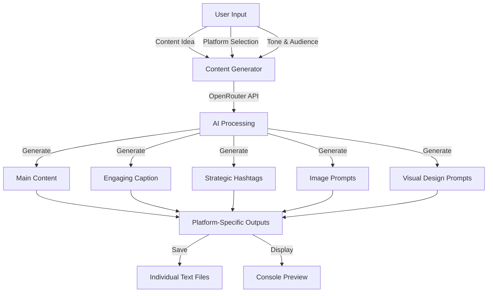
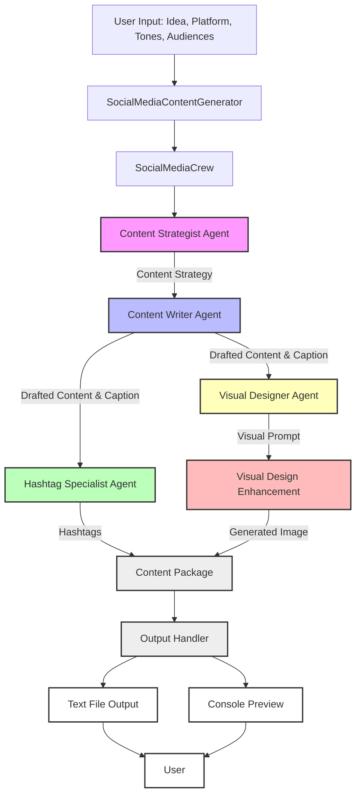
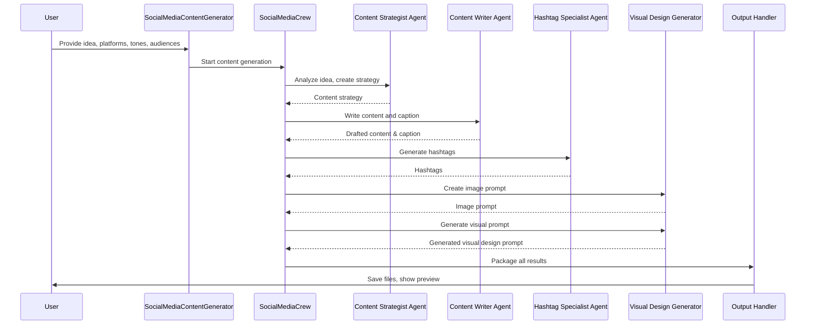

# Social Media Content Generator 🚀

An AI-powered content generation system that creates engaging social media posts using CrewAI and OpenRouter API. The system generates platform-optimized content, captions, and hashtags in seconds for multiple platforms simultaneously.

## ✨ Key Features

- **⚡ Fast Generation**: Content created in seconds
- **🎯 Platform-Specific**: Optimized for each social platform's unique style
- **📝 Complete Package**: Main content, captions, and hashtags in one go
- **🔄 Simple Input**: Just provide your idea and choose your platforms
- **📊 Smart Output**: Clean, formatted text files for easy use
- **🎥 Multi-Platform**: Generate content for multiple platforms at once
- **🎨 Consistent Branding**: Same tone and style across platforms
- **📈 Batch Processing**: Process multiple platforms in one run
- **🎬 YouTube Script Support**: Generates YouTube scripts with timestamps, resources, and a structured format
- **🎨 Visual Design**: AI-powered visual design prompts for content enhancement
- **🎛️ Flexible Model Configuration**: Support for multiple AI models (GPT-4, GPT-3.5, Claude, Llama)
- **📊 Advanced Logging**: Comprehensive logging system for debugging and monitoring
- **🎨 Multiple Content Tones**: 15 different tone options for content customization
- **👥 Targeted Audiences**: 20+ audience categories for precise targeting

## 🔄 How It Works



## 🛠️ Technical Flow & Agent Sequence

### System Flowchart



### Sequential Flow Diagram



### Sequential Flow
1. **User Input**: User provides idea, selects platforms, tones, and audiences.
2. **Content Generator**: Orchestrates the workflow.
3. **Crew Management**: `SocialMediaCrew` manages the following agents in sequence:
    - **Content Strategist Agent**: Analyzes the idea and creates a content strategy.
    - **Content Writer Agent**: Writes the main content **and the caption** based on the strategy.
    - **Hashtag Specialist Agent**: Generates relevant hashtags for the content.
    - **Visual Designer Agent**: Crafts an image prompt for visual content.
    - **Visual Design Integration**: Generates visual design prompts for content enhancement.
4. **Content Packaging**: All outputs are combined into a single package.
5. **Output Handling**: Results are saved to text files and previewed in the console.
6. **User Receives Output**: User can access the generated files and view the summary in the console.

> **Note:** The **Content Writer Agent** is responsible for both the main content and the caption for each platform.

---

## 🚀 Quick Start

### Prerequisites

- Python 3.8+ (Python 3.10 recommended)
- OpenRouter API key
- Internet connection

### Installation

1. **Clone and setup virtual environment:**
   ```bash
   git clone <repository-url>
   cd Social-media
   python -m venv venv
   source venv/bin/activate  # On Windows: venv\Scripts\activate
   ```

2. **Install dependencies:**
   ```bash
   pip install -r requirements.txt
   ```

3. **Configure environment:**
   Copy the template and create your `.env` file:
   ```bash
   cp env_template.txt .env
   ```
   
   Then edit `.env` with your settings:
   ```env
   # Required API Keys
   OPENROUTER_API_KEY=your_openrouter_api_key_here

   # Agent Model Settings (Choose your preferred models)
   # Option 1: GPT-4 Models (Recommended for best quality)
   CONTENT_STRATEGIST_MODEL=openai/gpt-4
   CONTENT_WRITER_MODEL=openai/gpt-4
   HASHTAG_SPECIALIST_MODEL=openai/gpt-4
   VISUAL_DESIGNER_MODEL=openai/gpt-4

   # Option 2: GPT-3.5 Models (faster and cheaper)
   # CONTENT_STRATEGIST_MODEL=openai/gpt-3.5-turbo
   # CONTENT_WRITER_MODEL=openai/gpt-3.5-turbo
   # HASHTAG_SPECIALIST_MODEL=openai/gpt-3.5-turbo
   # VISUAL_DESIGNER_MODEL=openai/gpt-3.5-turbo

   # Agent Temperature Settings
   CONTENT_STRATEGIST_TEMPERATURE=0.7
   CONTENT_WRITER_TEMPERATURE=0.8
   HASHTAG_SPECIALIST_TEMPERATURE=0.6
   VISUAL_DESIGNER_TEMPERATURE=0.7

   # Platform Settings
   MAX_HASHTAGS=30  # Maximum hashtags for Instagram
   ```

### Usage

Run the generator:
```bash
python src/main.py
```

The script will:
1. Ask for your content idea
2. Let you select multiple platforms (comma-separated)
3. Choose content tones and target audiences
4. Generate optimized content for each platform
5. Save individual output files
6. Show previews in console
7. Provide a generation summary

## 📝 Example Multi-Platform Generation

When you run the generator, you can select multiple platforms:
```
Which platforms would you like to create content for?
Available platforms: instagram, twitter, linkedin, facebook, tiktok, youtube
You can select multiple platforms by separating them with commas
Example: instagram, twitter, linkedin
Choose platforms: instagram, linkedin, twitter
```

The system will then:
1. Process each platform sequentially
2. Show progress for each platform
3. Generate platform-specific content
4. Save separate output files
5. Show a summary of successful generations

### Example Output Structure
```
=== Content Generation Summary ===

✅ Successfully generated content for: instagram, linkedin, twitter, youtube

📄 Output files:
- outputs/content_instagram_20250723_135002.txt
- outputs/content_linkedin_20250723_135003.txt
- outputs/content_twitter_20250723_135004.txt
- outputs/content_youtube_20250723_135005.txt
```

### Example YouTube Output
```
Original Idea:
I completed an AI course and want to share my experience

Style Settings:
Tones: professional, educational
Target Audiences: professionals, tech enthusiasts

Generated Content:
YouTube Script:
Unlocking the Power of AI: A Journey of Discovery 🚀

Introduction (0:00)
- The transformative potential of AI
- My motivation for taking an AI course
Main Points
1. Key Concepts Learned (0:45)
- Machine learning fundamentals
- Neural networks and deep learning
- Real-world AI applications
2. Hands-On Projects (2:30)
- Building an image classification model
- Developing a chatbot with natural language processing
- Deploying models in the cloud
3. Career Impact and Opportunities (4:15)
- How AI skills are in high demand across industries
- Leveraging AI to innovate and drive results at work
- New career paths opened up by AI mastery
Conclusion (5:30)
- Reflection on my AI learning journey
- Inspiration for others to embrace AI skills
- Exciting vision for an AI-powered future

Caption:
"🎓 I'm thrilled to announce I've completed an in-depth course on Artificial Intelligence! This journey equipped me with cutting-edge AI skills that I'm excited to apply at work and share with others.
Join me in this video as I recap the key concepts learned, showcase impactful projects, and discuss how AI mastery is unlocking new career opportunities. I hope my experience inspires you to embrace the transformative power of AI!"

Timestamps:
0:00 Introduction
0:45 Key Concepts Learned
2:30 Hands-On Projects
4:15 Career Impact and Opportunities
5:30 Conclusion
🔗 Links to my AI projects and resources in the description!

Suggested Hashtags:
#ArtificialIntelligence #MachineLearning #DeepLearning #AIcourse #ContinuousLearning #CareerGrowth #InnovationAtWork #FutureOfWork

Image:
https://openrouter.ai/api/v1/files/...
```

## 📁 Project Structure

```
Social-media/
├── src/
│   ├── agents/
│   │   ├── __init__.py
│   │   ├── content_strategist.py
│   │   ├── content_writer.py
│   │   ├── hashtag_specialist.py
│   │   └── visual_designer.py
│   ├── config/
│   │   ├── __init__.py
│   │   └── config.py
│   ├── tools/
│   │   ├── __init__.py
│   │   └── web_tools.py
│   ├── utils/
│   │   ├── __init__.py
│   │   └── url_scraper.py
│   ├── __init__.py
│   ├── crew.py
│   └── main.py
├── outputs/
│   └── [generated content files]
├── logs/
│   └── [generation logs]
├── .env
├── env_template.txt
├── requirements.txt
├── .gitignore
├── .cursorignore
└── README.md
```

## 🔧 Advanced Usage

### Platform-Specific Content
Each platform gets unique optimization:
- **LinkedIn**: Professional tone, industry insights
- **Instagram**: Visual descriptions, engaging emojis
- **Twitter**: Concise messages, trending hashtags
- **Facebook**: Conversational style, community focus
- **YouTube**: Detailed scripts with timestamps, resources, and SEO-optimized descriptions
- **TikTok**: Trendy hooks, viral potential

### Available Content Tones
Choose from 15 different tones:
- **Professional**: Business-focused, formal language
- **Casual**: Relaxed, conversational style
- **Elegant**: Sophisticated, refined language
- **Romantic**: Emotional, heartfelt content
- **Humorous**: Funny, entertaining posts
- **Inspirational**: Motivational, uplifting content
- **Educational**: Informative, teaching-focused
- **Friendly**: Warm, approachable tone
- **Formal**: Structured, official language
- **Persuasive**: Convincing, call-to-action focused
- **Enthusiastic**: Energetic, excited content
- **Mysterious**: Intriguing, suspenseful posts
- **Dramatic**: Emotional, impactful content
- **Minimalist**: Simple, clean language
- **Authentic**: Genuine, real-person voice

### Target Audiences
20+ audience categories including:
- **Age Groups**: teens, young adults, adults, middle-aged, seniors, children
- **Professional Groups**: professionals, students, entrepreneurs, executives
- **Interest Groups**: tech enthusiasts, creatives, health enthusiasts, luxury consumers, budget-conscious
- **Skill Levels**: beginners, experts
- **General**: general audience

### Output Format
Content is saved in clean text format. For YouTube, the output includes:
- Original Idea and Style Settings
- YouTube Script (with timestamps)
- Caption (**separate from timestamps**)
- Timestamps (**separate section**)
- Suggested Hashtags (separate section)
- Generated Image URL (if available)

For other platforms:
- Original Idea and Style Settings
- Generated Content
- Caption (no hashtags)
- Suggested Hashtags
- Generated Image URL (if available)

### AI Model Configuration
The system supports multiple AI models through OpenRouter:

**Recommended Models:**
- **GPT-4**: Best quality, higher cost
- **GPT-3.5-turbo**: Good quality, faster and cheaper
- **Claude 3 Sonnet**: Excellent reasoning and writing
- **Llama 3.1**: Good open-source alternative

**Model Configuration Options:**
1. **All GPT-4**: Highest quality across all tasks
2. **Mixed Models**: Different models for different tasks
3. **All GPT-3.5**: Cost-effective with good quality
4. **Custom Mix**: Your preferred combination

### Image Generation
- **Visual Design Integration**: AI-powered visual design prompts
- **Platform-Specific Prompts**: Optimized for each platform's visual style
- **Automatic Generation**: Images created based on content context
- **URL Storage**: Generated image URLs saved with content

## 🛠️ Customization

### Environment Configuration
- **Model Selection**: Choose different AI models for each agent
- **Temperature Control**: Adjust creativity levels for each agent
- **Platform Settings**: Customize hashtag limits and character counts
- **API Configuration**: Easy OpenRouter integration

### Code Customization
- **Prompt Customization**: Prompts for each platform can be easily updated in `src/crew.py`
- **Output Customization**: Output file structure can be changed in `src/main.py`'s `_save_result` method
- **Agent Behavior**: Modify agent logic in individual agent files
- **Platform Support**: Add new platforms in `src/config/config.py`

### Advanced Features
- **No Hashtags in Captions**: Captions are generated without hashtags; hashtags are only in the dedicated section
- **Comprehensive Logging**: Detailed logs for debugging and monitoring
- **Error Handling**: Robust error handling per platform
- **Progress Tracking**: Real-time progress updates during generation

## 🛠️ Technical Details

### System Flow
1. **Input Processing**
   - User provides content idea
   - Multiple platform selection
   - Content tone and audience selection

2. **Content Generation**
   - Sequential platform processing
   - Four specialized AI agents:
     * Content Strategist
     * Content Writer
     * Hashtag Specialist
     * Visual Designer
   - Platform-specific optimization
   - Visual design prompts

3. **Output Handling**
   - Individual text files per platform
   - Console preview for each generation
   - Progress tracking and summary
   - Detailed logging with color-coded output

### AI Integration
- **OpenRouter API**: Flexible model selection and cost optimization
- **Multiple Model Support**: GPT-4, GPT-3.5, Claude, Llama, and more
- **Optimized Prompts**: Platform-specific prompts for each agent
- **Specialized Agents**: Different models and temperatures for different tasks
- **Fast Processing**: Efficient parallel processing where possible
- **Error Handling**: Robust error handling per platform and agent

### Dependencies
- **CrewAI 0.14.0**: Multi-agent orchestration framework
- **LangChain**: AI model integration and prompt management
- **OpenRouter**: Access to multiple AI models
- **Python-dotenv**: Environment variable management
- **Requests**: HTTP client for API calls
- **BeautifulSoup4**: Web scraping capabilities
- **Pillow**: Image processing
- **Colorlog**: Enhanced logging with colors

## 🤝 Support

### Troubleshooting
1. **API Key Issues**: Check your OpenRouter API key in `.env`
2. **Model Configuration**: Verify model names in environment variables
3. **Internet Connection**: Ensure stable internet for API calls
4. **Platform Selection**: Verify platform names are correct
5. **Logs**: Check `logs/` directory for detailed error information

### Getting Help
1. Check the console for error messages
2. Review logs in the `logs/` directory
3. Verify your `.env` configuration
4. Ensure all dependencies are installed
5. Check OpenRouter API status and credits

### Common Issues
- **Model Not Found**: Verify model names in OpenRouter's model list
- **API Rate Limits**: Check your OpenRouter usage and limits
- **Visual Design Failures**: Verify visual prompt generation
- **Memory Issues**: Ensure sufficient system resources

## 📄 License

This project is licensed under the MIT License - see the LICENSE file for details.

---

**Happy Content Creating! 🎨✨**

*Built with ❤️ using CrewAI and OpenRouter* 